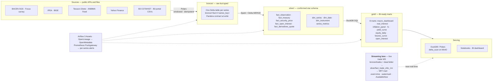

# Open-Finance LakeHouse

[](https://github.com/rmonteiro-pereira/Open-Finance-LakeHouse/actions/workflows/tests.yml)
[](LICENSE)

**A production-shaped medallion lakehouse for Brazilian macro & financial data — 51 registered
series across 10 source handlers (BACEN, IPEA, IBGE, Tesouro Nacional, ANBIMA, B3, Yahoo Finance),
landed as Delta on MinIO, conformed by Spark into a star schema, and served as DuckDB marts.
Metadata-driven end to end, orchestrated by Airflow 3 Assets, running on a self-hosted Kubernetes
cluster.**

> **Polars extracts → Spark refines → DuckDB serves.** One engine per lane, every lane driven by a
> single source registry ([`sources/registry.yml`](sources/registry.yml)). Adding a BACEN series is
> a one-entry YAML change; adding a *kind* of source is one handler.

This is deliberately **small data** — no engine here is load-bearing for volume. Each is chosen as
the right tool for its lane, and the engineering that matters is the part that survives production:
idempotent `MERGE` upserts, per-series blast-radius isolation, data contracts at ingest, per-series
alerting, and lineage. Full design rationale in
[`docs/architecture/redesign.md`](docs/architecture/redesign.md).

---

## Architecture



**Storage layout** — everything is Delta Lake in the MinIO bucket `lakehouse`:

```
s3://lakehouse/
  bronze/<fact>/<series_key>    # raw-but-typed, one table per registered series
  silver/<table>                # conformed facts + dimensions (star schema)
  gold/<mart>                   # ready-to-plot marts
```

### Orchestration topology

Airflow 3 **data-aware Asset scheduling** — not one mega-DAG, not 51 DAGs to babysit. The whole
topology is generated from the registry at parse time, so it is **13 DAGs / 51 bronze assets**
today and re-derives itself the moment a series is added:

```
ofl_ingest_<handler>   (x10 — one DAG per source handler, the unit that actually fails together)
   └── one static task per series ──emit──▶ Asset(lakehouse://bronze/<series>)   (x51)
                                                    │  any bronze asset
                                                    ▼
                          ofl_silver  (Spark MERGE) ──emit──▶ Asset(silver/fact_observation)
                                                    │
                                                    ▼
                          ofl_gold    (DuckDB marts) ──emit──▶ Asset(gold/marts)

ofl_backfill — manual full-rebuild button (ingest-all → silver → gold), idempotent.
```

Design decisions worth calling out:

- **Per-series isolation.** Every series is its own static task with its own bronze Asset and its
  own `on_failure_callback`. A failing API or a rejected data contract withholds exactly one asset
  and raises exactly one individually-attributable alert — siblings keep running.
- **DAG per *handler*, not per domain.** The blast radius of an API outage, an expired token or a
  rate-limit is the *source*, so that is the DAG boundary.
- **Silver/gold stay singletons** with `max_active_runs=1` and idempotent `MERGE`, so a bursty
  stream of bronze asset events coalesces into one safe run.
- **Memory is governed by Airflow pools**, not by DAG granularity: all ingest pods share
  `ofl_ingest` (2 slots); Spark runs alone in `ofl_spark` (1 slot) on the single node.
- Every lane runs as a `KubernetesPodOperator` pod on one of two purpose-built offline images —
  `:slim` (Polars ingest + DuckDB gold, no JVM) and `:spark` (silver conform/MERGE).

---

## Tech stack

| Layer | Choice | Why it's here |
|---|---|---|
| Extraction | **Polars** | API pulls are I/O-bound and single-machine; fast, low-RAM, excellent date/number parsing |
| Storage | **Delta Lake** on **MinIO** (S3-compatible) | ACID upserts, time travel, schema enforcement; catalog of record |
| Conform / refine | **Spark 3.5 + delta-spark** | Idempotent `MERGE`, window functions, `OPTIMIZE`/`ZORDER`, `VACUUM` |
| Serving | **DuckDB** (`delta_scan`) | Query-on-the-lake: sub-second SQL over Delta straight from object storage; writes back via delta-rs |
| Streaming | **Spark Structured Streaming** | Event-time windows + watermark, checkpointed exactly-once, `Trigger.AvailableNow` so the lane is cron-shaped — see [Streaming lane](#streaming-lane) |
| Orchestration | **Airflow 3** (Assets, `KubernetesPodOperator`) | Data-aware scheduling, per-series assets, pool-based concurrency |
| Data quality | **Pandera** (Polars-native) | Contracts at ingest: dtypes, non-null keys, `(series_id, date)` uniqueness, per-series sanity bounds |
| Lineage / catalog | **OpenLineage → OpenMetadata** | Run-level + column-level lineage, env-gated so local runs need no backend |
| Metrics / alerting | **Prometheus Pushgateway → Alertmanager** | Short-lived pods *push* freshness/DQ/failure gauges; per-series alerts |
| Config | **Pydantic Settings** (12-factor) | No secrets in code — env vars / sealed secrets only, and [`ofl/config.py`](ofl/config.py) *refuses to start* if the vendor default credentials would be sent to a non-loopback endpoint |
| Packaging | **uv**, **hatchling**, **ruff**, **mypy**, **pytest** | Reproducible installs, lint/type/test gates |
| Platform | **Talos Linux Kubernetes**, **Flux CD**, **Sealed Secrets**, **GHCR** | GitOps-managed self-hosted cluster; see [`GUIA_ACESSO_FERRAMENTAS.md`](GUIA_ACESSO_FERRAMENTAS.md) |

Heavy deps are **extras**, so the core install stays light:
`.[spark]`, `.[streaming]`, `.[airflow]`, `.[yahoo]`, `.[lineage]`, `.[dev]`.

---

## Data coverage

**51 registered series across 10 source handlers** — all driven from
[`sources/registry.yml`](sources/registry.yml).

| Domain | Series | What's in it |
|---|---:|---|
| `inflation` | 12 | IPCA, IPCA-15, INPC, IGP-M/DI/10, IPC-FIPE, 4 IPCA core measures, Focus 12m IPCA expectation |
| `rates` | 9 | SELIC (over + Copom target), CDI (daily + annualized), TR, TLP, poupança, Focus end-of-year SELIC |
| `fiscal` | 8 | Gross (DBGG) & net (DLSP) debt/GDP, primary balance, international reserves, IBC-Br, IPEA GDP/debt series |
| `market` | 8 | Tesouro Direto (7 bonds), ANBIMA TPF + IMA-B / IMA-B 5 / IRF-M, Ibovespa, IBGE unemployment, global benchmarks (S&P 500, Nasdaq, VIX, US 10Y, DXY, Brent, EUR/USD, USD/MXN) |
| `fx` | 4 | USD/BRL (PTAX buy & commercial), EUR/BRL, Focus end-of-year USD/BRL |
| `equities` | 4 | Yahoo ETF / commodity / currency families (11 symbols) + B3 COTAHIST official cash-market OHLCV |
| `credit` | 3 | Total outstanding credit (SFN), household & corporate NPL rates |
| `derivatives` | 2 | B3 open interest and settlement/price files (futures: DI1, DOL, IND, WIN, WDO, agribusiness) |
| `reference` | 1 | B3 instrument registry → `dim_instrument` (expiry, multiplier, strike, ISIN) |

| Handler | Series | Source |
|---|---:|---|
| `bacen_sgs` | 30 | BACEN SGS open API (rates, inflation, FX, fiscal, credit) |
| `anbima` | 4 | ANBIMA Feed API (OAuth) — currently pointed at the **sandbox** |
| `yahoo` | 4 | Yahoo Finance (ETFs, commodities, currencies, global benchmarks) |
| `bacen_focus` | 3 | BACEN Focus market-expectations survey (Olinda OData) |
| `ipea` | 3 | IPEAdata |
| `b3_arquivos` | 3 | B3 public market-data portal (`arquivos.b3.com.br`) daily CSVs |
| `tesouro_direto` | 1 | Tesouro Transparente CKAN dataset |
| `b3` | 1 | Ibovespa index levels |
| `b3_cotahist` | 1 | Official B3 COTAHIST annual files (15-ticker blue-chip watchlist, 2024–2025) |
| `ibge` | 1 | IBGE PNAD Contínua unemployment |

### Silver star schema

| Table | Grain | Fed by |
|---|---|---|
| `fact_observation` | `(series_id, date)` | 40 single-value macro series, unioned into one canonical long table |
| `fact_security_price` | `(symbol, date)` | 6 OHLCV sources (Yahoo families, Ibovespa, COTAHIST) |
| `fact_treasury` | `(bond, date)` | Tesouro Direto + ANBIMA TPF |
| `fact_open_interest` | `(symbol, date)` | B3 derivatives open positions |
| `fact_derivatives_quote` | `(symbol, date)` | B3 consolidated trades + daily settlement |
| `dim_series` · `dim_date` · `dim_instrument` | — | Registry-derived catalog, 1980–2035 calendar, B3 contract registry |
| `series_metrics` | `(series_id, date)` | Spark window functions: pct change, rolling 3/12 avg, 12-period vol |

### Gold marts

`mart_macro_dashboard` · `mart_real_interest` · `mart_inflation_panel` · `mart_fx` ·
`mart_yield_curve` · `mart_equity_daily` · `mart_futures_curve` · `mart_open_interest`

Column-level detail and query recipes live in
[`docs/DASHBOARD_HANDOFF.md`](docs/DASHBOARD_HANDOFF.md).

### Honest caveats

- BRL macro series are floored at the **Plano Real (1994-07-01)** — pre-Real cruzeiro/hyperinflation
  data is economically incomparable and trips the quality contracts.
- **ANBIMA** series run against the ANBIMA **sandbox**: format-real but *fictitious* values. Real
  production data needs Feed API approval.
- B3 derivatives cover **futures segments only** (FINANCIAL + AGRIBUSINESS); history starts around
  **October 2019**, the public portal's earliest. Securities lending (`LoanBalance`) is gated to
  B3's paid tier and is not ingested.
- Annualized rates (`over`, `cdi_anual`) legitimately reach ~173%/yr in the 1994–97 stabilization;
  the sanity bounds are set to preserve that history, not clip it.
- `value` units differ by series — always read `dim_series.unit` before putting two series on one axis.

---

## Quickstart

```bash
uv sync                       # core install; add extras as needed
uv sync --extra spark --extra dev

ofl registry                  # list the registered series, by domain
ofl ingest --series selic     # one series  → bronze (Polars)
ofl ingest --domain rates     # one domain  → bronze
ofl ingest                    # all active series
ofl silver                    # bronze → silver star schema (Spark MERGE + dimensions)
ofl gold                      # silver → gold marts (DuckDB)
ofl gold --dry-run            # compute marts without writing
```

Configuration is environment-driven — no secrets in code:

| Variable | Purpose |
|---|---|
| `MINIO_ENDPOINT` / `MINIO_USER` / `MINIO_PASSWORD` | Object store connection. Defaults are MinIO's *published* factory credentials so a scratch localhost stack needs no setup — `Settings` raises if they would be sent anywhere but loopback |
| `LAKEHOUSE_BUCKET` / `AWS_REGION` | Bucket and nominal region |
| `OFL_REGISTRY` | Registry path override (defaults to `sources/registry.yml`) |
| `OFL_SPARK_DRIVER_MEMORY` / `OFL_SPARK_JARS_PACKAGED` | Silver-lane Spark tuning |
| `OPENLINEAGE_URL` / `OFL_PUSHGATEWAY_URL` | Lineage & metrics backends (optional; unset = no-op) |
| `OFL_B3_WINDOW` | `YYYY-MM-DD..YYYY-MM-DD` backfill window for the B3 portal lane |

**Containers.** Two offline images (pods have no external egress), built from `docker/`:

```bash
docker build -f docker/Dockerfile       -t ghcr.io/rmonteiro-pereira/open-finance-lakehouse:slim  .
docker build -f docker/Dockerfile.spark -t ghcr.io/rmonteiro-pereira/open-finance-lakehouse:spark .
```

**Tests** — 134 offline unit tests covering the registry loader, the extractor parsing paths
(including the BACEN SGS window walk), the Pandera contracts, the gold SQL models and the streaming
window/watermark logic. They need no
cluster, no MinIO, no Spark session and no API keys, which is what makes the CI badge mean
something (see [`.github/workflows/tests.yml`](.github/workflows/tests.yml)):

```bash
uv run pytest
uv run ruff check .
```

---

## Repo map

```
ofl/                          # the package
  cli.py                      # `ofl ingest | silver | gold | registry`
  config.py                   # pydantic-settings, env-driven
  registry.py                 # typed loader for sources/registry.yml
  platform/                   # spark session, MinIO/Delta IO, logging, metrics, lineage
  ingestion/                  # 10 Polars extractors + bronze landing
  transform/spark/            # silver: conform MERGEs, dimensions, window KPIs, OPTIMIZE/VACUUM
  transform/gold/             # 8 DuckDB SQL marts + runner
  streaming/                  # Spark Structured Streaming lane: producer, bronze, event-time silver, NRT mart
  quality/                    # Pandera contracts
sources/registry.yml          # single source of truth — drives ingestion, DAGs, dims, catalog
orchestration/airflow/dags/   # Asset DAGs generated from the registry + failure-alert callback
docker/                       # :slim and :spark offline images (see docker/README.md)
docs/                         # architecture/redesign.md · STREAMING.md · DASHBOARD_HANDOFF.md · GOLD_EXPORT.md
tools/                        # gold export + the streaming idempotence harness
tests/                        # pytest suite
notebooks/                    # exploratory analysis
```

Also in the repo: [`GUIA_ACESSO_FERRAMENTAS.md`](GUIA_ACESSO_FERRAMENTAS.md) (pt-BR) — a **generic**
runbook for reaching every service on the cluster: Airflow, MinIO, OpenMetadata,
Grafana/Prometheus/Loki, the event bus, PostgreSQL, Sealed Secrets, Flux CD. It carries placeholders
and the `kubectl` command that reads each credential from its `Secret` — never a hostname, a
private-range IP, or a credential value.

---

## Operations & reliability

The parts that make this behave like a system rather than a set of scripts:

- **Idempotency everywhere.** Every silver table is a Delta `MERGE` on its natural key, with
  latest-ingestion dedup upstream. Re-running any lane — or the whole `ofl_backfill` — converges to
  the same state.
- **Data contracts at the door.** Pandera validates every bronze write; a violation fails that
  series only, records a DQ metric, and withholds its asset so silver never sees bad data.
- **Per-series observability.** Ingest pods push `ofl_series_last_success_timestamp_seconds` (the
  latest landed *data* date, not wall-clock), plus DQ and failure gauges, keyed by
  `{series, source, domain, cadence}` — the same series key joins Prometheus, OpenMetadata and the
  OpenLineage job name. Alerts fire per series, only after retries are exhausted.
- **Resilient extractors.** The BACEN SGS lane walks the API's forced 10-year windows and dedups the
  overlap; the B3 portal lane retries its two-step token handshake and skips holidays and
  empty/malformed files instead of failing a multi-year backfill.
- **Delta housekeeping.** A `maintain()` routine compacts and `ZORDER`s the conformed fact by
  `(series_id, date)` and `VACUUM`s old files — implemented and callable, not yet on a schedule,
  because at this scale it isn't earning its run time.
- **Right-sized for one node.** Pods request 256Mi and burst to their limits; the silver Spark pod
  gets a 4g driver heap because the largest fact (`fact_derivatives_quote`, ~1.6M rows) is re-merged
  in full each run.

---

## Streaming lane

The batch lanes run on a schedule over closed periods. This lane runs **continuously over a live
market feed**, so the platform tells a **batch + streaming (Lambda/Kappa)** story rather than a
batch-only one — same storage format (Delta), same medallion layers, same lineage columns, a
different clock. Code lives in [`ofl/streaming/`](ofl/streaming/); the full write-up is
[`docs/STREAMING.md`](docs/STREAMING.md).

```
 public trade WS      ofl stream-produce      ofl stream-bronze       ofl stream-silver
 <symbol>@trade  ───► _landing/*.jsonl  ───►  bronze/trades/    ───►  silver/fact_trade_ohlc_1m/
 (free, no auth)                              bronze/trades_dead_letter/        │
                                        _checkpoints/bronze_trades/             ▼
                                        _checkpoints/silver_ohlc_1m/     NRT DuckDB mart
```

```bash
uv sync --extra spark --extra streaming
uv run ofl stream-produce --symbols btcusdt,ethusdt --max-seconds 170
uv run ofl stream-bronze  --available-now      # landing → bronze Delta
uv run ofl stream-silver  --available-now      # bronze → 1-min event-time OHLC bars
uv run ofl stream-mart                         # bars → served near-real-time mart
```

The parts that are the actual engineering, not the demo:

- **Event-time, not processing-time.** 1-minute OHLC windows keyed on the exchange's trade
  timestamp with an explicit watermark, so late and out-of-order arrivals land in the bar they
  belong to instead of the bar that happened to be open.
- **Idempotent by checkpoint *and* by Delta transaction.** Offsets and commits live in per-query
  checkpoint directories, and each `foreachBatch` Delta write carries `txnAppId`/`txnVersion`, so a
  batch replayed after a mid-write crash is recognised by the Delta log and skipped instead of
  double-written. [`tools/streaming_idempotence.py`](tools/streaming_idempotence.py) runs two
  `Trigger.AvailableNow` passes in separate processes and compares counts, so this is a *measured*
  claim rather than an asserted one.
- **`Trigger.AvailableNow`, so the lane costs ~nothing.** The expensive thing about streaming is a
  cluster left on, not Spark. Each run drains what has arrived and exits, which makes the whole
  lane cron-shaped and free to operate.
- **Never schema-inferred.** The wire format is pinned as DDL in
  [`ofl/streaming/schema.py`](ofl/streaming/schema.py). Reading with the *text* source and applying
  `from_json` ourselves turns a malformed record into **a row we can route** — rejects go to
  `bronze/trades_dead_letter` verbatim with a `reason`, replayable once the cause is understood,
  instead of failing the task or vanishing.
- **Bounded by design.** Producer and Spark jobs both terminate on explicit caps, and each stage is
  decoupled from the next by durable storage, so nothing has to be alive for anything else to run.

---

## Roadmap

The **streaming lane** has shipped — see [Streaming lane](#streaming-lane) above. What is left:

- **Streaming: promote the cron tier to *live*.** The lane runs `Trigger.AvailableNow` end to end
  today; making the scheduled tier durable needs an always-on object store for Delta +
  checkpoints between ephemeral runs. Provisioning that bucket is human-gated and deliberately
  not automated — see [`docs/STREAMING.md`](docs/STREAMING.md) §Roadmap.
- **Streaming: converge on the batch star schema.** The lane keeps its own
  `silver/fact_trade_ohlc_1m` rather than merging into `fact_security_price`; unifying the two
  grains is the remaining Lambda/Kappa step.
- **RAG project over the gold marts** — a retrieval layer answering natural-language questions about
  Brazilian macro directly from `fact_observation` + `dim_series` + the marts, using the registry as
  the semantic dictionary.
- **BI dashboard** — a front end over the gold marts; the contract it builds against is already
  written up in [`docs/DASHBOARD_HANDOFF.md`](docs/DASHBOARD_HANDOFF.md).
- **ANBIMA production data** — swap the sandbox host for the production Feed API once credentials
  are approved.
- **Screenshots** — the Airflow asset graph, a gold mart preview and the per-series Grafana
  panel, captured from the running cluster.

---

## Author, license & data sources

Built by **Rodrigo Monteiro Pereira** as a portfolio-grade data platform.

The code in this repository is released under the **MIT License** — see [`LICENSE`](LICENSE).

All data comes from public APIs and files published by BACEN, IBGE, IPEA, Tesouro Nacional, ANBIMA,
B3 and Yahoo Finance — each remains subject to its own terms of use, which the MIT license on this
code does not extend to. Nothing here is investment advice.
